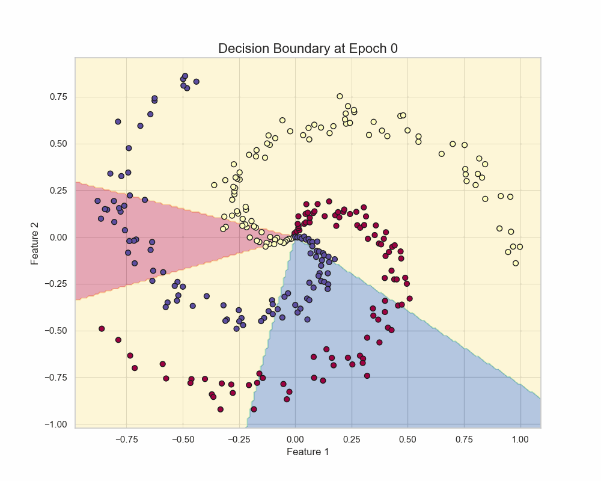
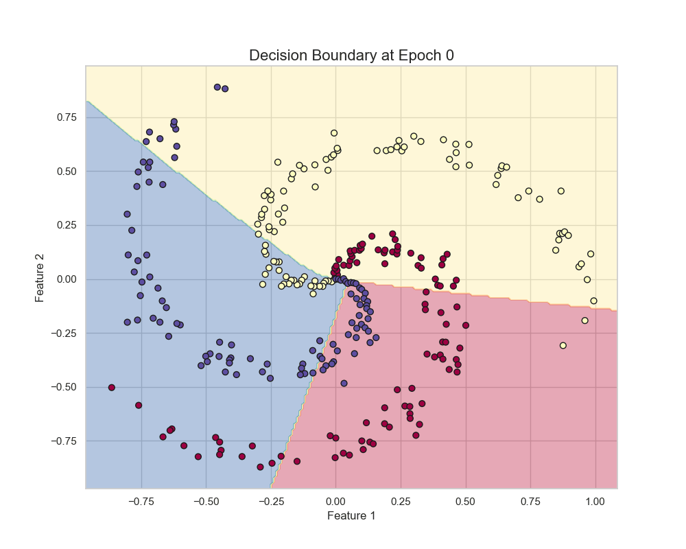
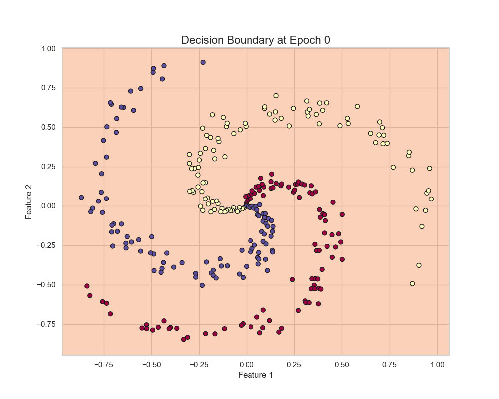

# reverse-autodiff-engine

# Reverse-Mode Automatic Differentiation Engine

This repository contains my implementation of a **reverse-mode automatic differentiation (autodiff) engine** from scratch, built as a programming exercise for my **Neural Networks course**.



*Animation showing how the model's decision boundary evolves during training*

## 📌 Project Overview

This project demonstrates a complete understanding of how deep learning frameworks work under the hood by implementing:
- A **tensor library** with automatic differentiation capabilities
- Various **mathematical operations** (addition, multiplication, matrix multiplication, etc.)
- **Activation functions** (ReLU, Sigmoid, Softmax)
- **Loss functions** (Cross-Entropy with Softmax)
- **Optimizers** (SGD with Momentum, Adam)
- A simple **neural network module system**

The autodiff engine uses reverse-mode differentiation (backpropagation) to compute gradients automatically, exactly like frameworks such as PyTorch and TensorFlow do.

## 📁 Project Structure

```
├── tensor.py       # Tensor class with autodig capabilities
├── function.py     # Mathematical operations (Add, Mul, MatMul, etc.)
├── module.py       # Base Module class and Linear layer
├── optimizer.py    # SGD with momentum and Adam optimizers
├── example.py      # Training script on spiral dataset
└── README.md       # This file
```

## 🧠 Key Components

### Core Engine
- **`tensor.py`**: The `Tensor` class that tracks operations and enables automatic differentiation
- **`function.py`**: Implementation of mathematical operations with forward/backward passes:
  - `Add`, `Mul`, `MatMul` - Basic arithmetic
  - `Pow`, `Log`, `Sum` - Element-wise operations  
  - `ReLU_function`, `Sigmoid`, `Softmax` - Activation functions
  - `CrossEntropyWithSoftmax` - Loss function

### Neural Network Components
- **`module.py`**: Base `Module` class and `Linear` layer implementation
- **`example.py`**: Complete training example on spiral dataset with visualization

### Optimizers
- **`optimizer.py`**: 
  - `SGD` with momentum
  - `Adam` optimizer

## 📊 Experiments

The repository includes experiments on the **spiral dataset** (3 classes, 2 features) to compare different activation functions and optimizers:

### Activation & Optimizer Comparisons

| Configuration | Description |
|--------------|-------------|
| **ReLU + Adam** | ReLU activation with Adam optimizer - fastest convergence |
| **ReLU + SGD (with momentum)** | ReLU activation with SGD + momentum - stable learning |
| **Sigmoid + Adam** | Sigmoid activation with Adam - slower but smooth |
| **Sigmoid + SGD (with momentum)** | Sigmoid activation with SGD + momentum - struggles with deeper regions |

*1.ReLU activation with Adam optimizer - fastest convergence*



*2.ReLU activation with SGD + momentum - stable learning*

.gif)

*3.Sigmoid activation with Adam - slower but smooth*



*4.Sigmoid activation with SGD + momentum - struggles with deeper regions*

.gif)


## 🚀 Key Features

- **Pure NumPy implementation** - No deep learning frameworks used
- **Automatic differentiation** - Computes gradients automatically via computation graph
- **Modular design** - Easy to add new operations and layers
- **Educational** - Clear, readable code perfect for learning

## 📝 What I Learned

- How automatic differentiation works under the hood
- Building and traversing computational graphs
- Implementing backpropagation from scratch
- Comparing optimization algorithms and activation functions
- Creating a mini deep learning framework

## 🛠️ Quick Start

Run the full example:
```bash
python example.py
```

---

*This project was developed as part of my coursework to deeply understand the fundamentals of neural networks and automatic differentiation.*
